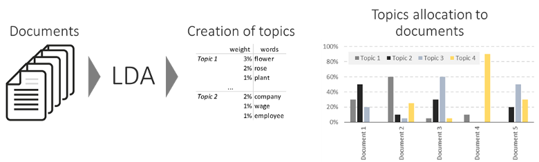
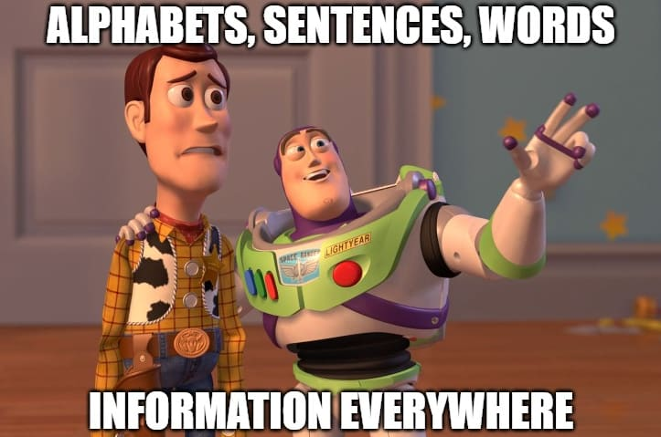
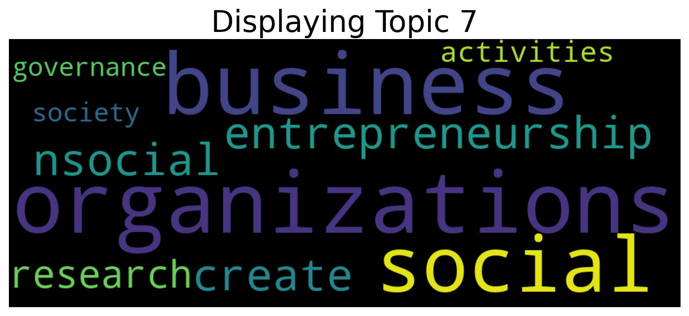
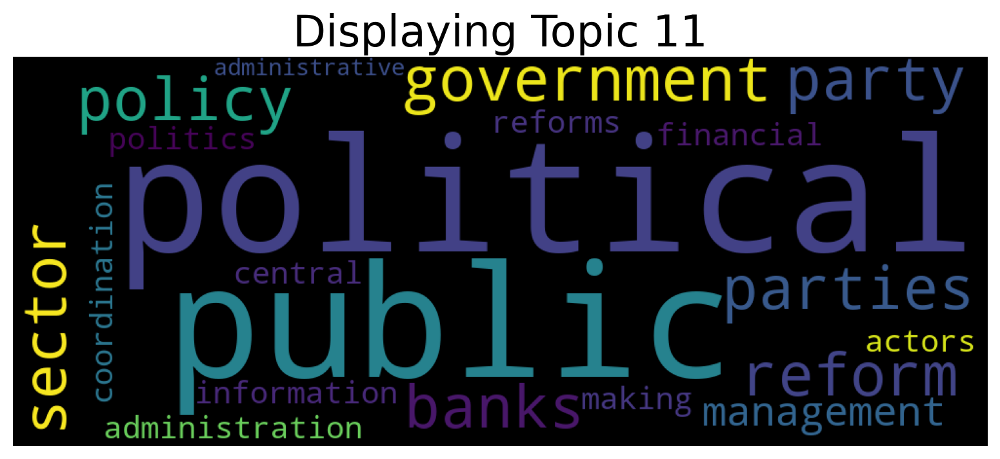
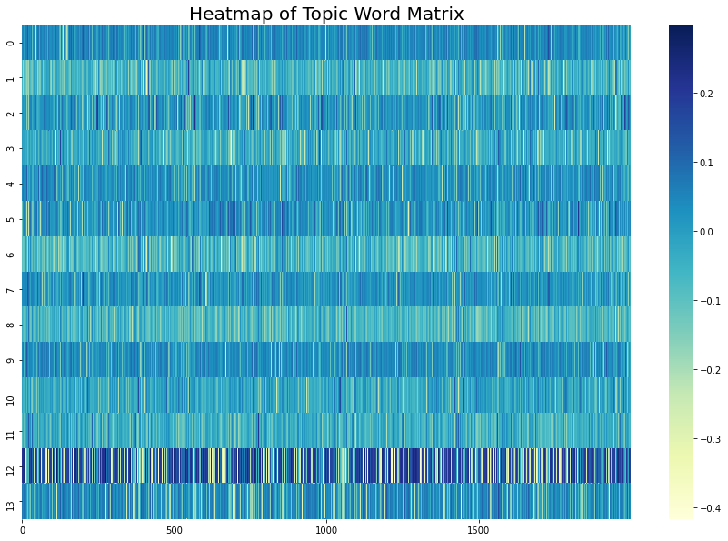
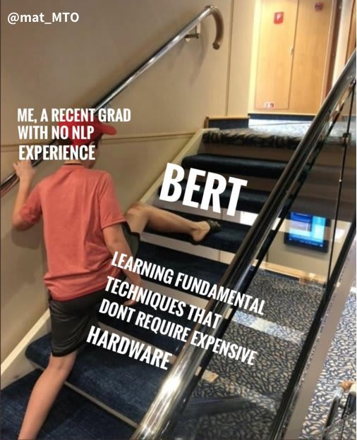

```{r setup, include=FALSE}
knitr::opts_chunk$set(echo = FALSE)

# Load dependencies 
library(reticulate) # For rendering Python code 
library(kableExtra)
```

## Abstract 

Using the Contextualized Topic Model (CTM), we identify academic topics covered by the faculty of the Hertie School in their published papers. The outputs of the model will be available on a web application that aims to support students in their thesis supervisor selection. On the web application, students can get an accessible overview of all potential supervisors' research fields to find the one that can best guide them substantively. The tool is especially recommended for students that have not been able to get familiar with the whole body of the faculty and would like to make sure their supervisor is the best fit for them. The CTM is most successful in identifying coherent topics on texts that entails proper sentences with a semantic structure as opposed to bullet points with very low word count. 
 

## Introduction / Background

If you've happened to come across this website, you're either a student that is taking the NLP class at Hertie and would like to get a great example of a potential semester project or you're a 2nd year student anxious to get started on the MA thesis road. In any case, you've come to the right place.\n

This project was inspired by the recurring challenge in the fall semester, when Hertie students and administrative staff alike have to match suitable and available supervisors to students' master theses. The task is - as you can probably imagine - very laborious. As a Hertie student, you are required to indicate three preferences of supervising professors in decreasing order of rank. But what if you have no idea? You've probably only met 5 professors, but there are 28 options out there! The agony. Worst of all? There is no good overview on the Moodle platform: you're forced to manually and individually download the supervision plan. 

```{r fig1, eval = TRUE, echo = FALSE, out.width = '70%', fig.cap = "Source: Own work."}

```

But don't lose hope yet because your seniors are here to come to your aid! We know that the choice of the supervisor matters. It certainly is relevant to the progress and quality of your thesis, potentially even to your work opportunities after graduation! That is why we have developed this tool. \n

The tool provides a lucid and accessible overview over the wide range of fields of academic expertise in the school's faculty body. It expands the work of last semester's student from the class "Python for Data Scientists", who built a simple LDA model and similarity index based on user input.^[Available under (https://github.com/cbsobral/python)] Sounds like a mouthful? Is a mouthful. No worries, everything is going to be explained below. Just stay with us!\n 

However, in case you are familar with these terms and totally know what's going on, here is the **TDLR**: LDA's biggest advantage, Bag-of-Words, turns out to be its deficiency. CTM addresses the lack of contextual information capture by integrating pre-trained BERT sentence embeddings. [@bianchi2020pre] CTM is a fairly new model, but it's proven to be super successful in our case!


## Related Work 

We've been throwing around some fancy terms making us appear real clever, but that is not the goal of this blog post. We want you to understand what's going on! After all, what is a teacher's worth if the students don't get it?\n

The general challenge of topic modeling is the detection of underlying topics in documents and the correct identification of patterns to match documents to topics. Documents describes the text unit of interest such as individual Twitter tweets, mails, papers, reports, etc. So the goal is to be able to identify topics and to create a pattern that is able to match unseen documents to established topics.\n

Let's say you've been tasked with sorting mail. Super tedious work. As you begin to go through each of the letters, you identify categories of letters: bills, advertisement, reminders and notifications of changes. The first pile is done, now on to the next pile we go. However, this pile is somewhat different from the first pile. However, you're clever and confident that you can clearly match the unseen letters to the categories (topics) you've established in the first pile. Get it?\n 

But how does a machine even comprehend text? Easy - by numbers! Every word is turned into a token, i.e. a number. We call that step "encoding". Fancy term there! Now that we've established the foundations, let's get into the nitty-gritty details!\n

```{r fig2, eval = TRUE, echo = FALSE, out.width = '70%', fig.cap = "Source: https://towardsdatascience.com/a-simple-explanation-of-the-bag-of-words-model-b88fc4f4971"}
knitr::include_graphics("figures/bow.png")
```

Latent Dirichlet Allocation (LDA) is a popular machine learning probabilistic algorithm used for topic modeling. The figure below illustrates how it basically works. It discovers topics and then matches these topics to documents. In the end, you get a table of documents with their proportional share to each topics. Going back to our mailbox example: let's say the first letter (document) is advertisement but there is also a bit of a reminder. Ideally, LDA would return that the document of interest is 60\% advertisement and 39\% reminder, 0.5\% bill and 0.5\% notification of changes. Why 0.5\%? That is how probability works! You can never fully rule out that something happens, you just know that it is veeeeery unlikely to happen.\n

```{r fig3, eval = TRUE, echo = FALSE, out.width = '70%', fig.cap = "Source: https://www.kdnuggets.com/2019/09/overview-topics-extraction-python-latent-dirichlet-allocation.html"}

```

But what's machine learning? Standard LDA models are trained once on a training set, i.e. there is one process of identifying and establishing topics. It might be a long process but after the process is done, there is no more training. The model is left untouched, its sole purpose then is to be employed. That is different for deep learning models! They're configured to continuously learn. Every time they get new input, parameters inside the models are set to achieve optimal performance.\n 

But how exactly does LDA find topics? The answer to that very good question is Bag-of-Words (BoW - not to be mistaken with the immensely popular Nintendo Switch game Breath of the Wild (BOTW)). Each document is considered a collection of words, the goal is to identify words distinctive to the document. What then? We get the Term Frequency to get the raw count of words within a document and Inverse Document Frequency to indicate the informative value of words by their frequency in a document compared to their frequency across all other documents. So Term Frequency is interested in what words are used very often and Inverse Document Frequency acts a checks and balance! Words such as "and", "or", "but", etc. appear very often but they do not carry any informative value.

LDA models have successfully been used in the past, such as in the Toronto Paper Matching System. [@charlin2013toronto] The task here was to match submitted papers to reviewers for peer-review journals. The challenge is the amount of both submissions and reviewers. The Toronto Paper Matching System, thus, happens to be a very similar use case to ours! The authors used reviewers' publications to elicit initial expertise scores (topics). This inspired our method! However, we decided not to consider LDA for two reasons: 1) This project is part of a "Natural Language Processing" class at Hertie, focusing on Deep Learning. 2) Bag-of-Words representations are also limited in what information they can extract. In perceiving documents as bag of words, it is unable to comprehend the semantics and context of words. The structure of sentences, e.g. the grammatical role and order of words, does not matter to Bag-of-Words.\n

```{r fig7, eval = TRUE, echo = FALSE, out.width = '70%', fig.cap = "Source: https://dev.to/spectrumcetb/evolution-of-nlp-f54"}

```

So how do we capture context? One solution is word2vec, which uses word embeddings. Another fancy term here! You're certainly going to sound very smart by the end of this blog post! Simply plut, word embeddings are learned representation for encoded text (number) where words try to capture as much of the semantic, lexical and context information as possible. In other words, how words are encoded, i.e. turned into numbers, matters a great deal. Word2vec employs two different techniques for word embedding: Continuous Bag of Words (CBoW), predicting a word given its context, and Skip-Gram, predicting the context given a word. It's all probabilities really. The end goal is for words with similar meaning to end up with similar encodings or numeric representations. By doing so, word2vec attempts to integrate the context. However, the catch to word2vec is that it only provides one numeric representation for each word. For example, the word "bank" would erroneously have the same numeric representation in the sentences "We went to the river *bank*."and "I need to go to the *bank* to make a deposit."*. However, a river bank is vastly different from a bank that has money! Thus, in combining different meanings and usages of the same word into a single numeric representation, word2vec inadvertently ends up generating context-independent word embeddings.\n

So what's the latest trend? For once, all the previously mentioned techniques are not entirely discarded. On the contrary, people combine them with other things! More on that on the next section. But to answer that question: it is Pre-trained language models. Pre-trained language models are huge models (and by huge, we mean: really huge models that your and our computer would not be able to handle), that have been trained on millions to billions of documents to learn as much as possible. So instead of developing our own model, we use a pre-trained model and just finetune it on our data, i.e. reconfigure it for our purposes. The rationale is the following: the pre-trained model has an understanding of language much greater of what we could build with our flimsy computers, so we leverage them to achieve higher topic coherence. On our own, we've probably end up with weird and random topics, but we pre-trained language models, everything looks so much better!\n

One such pre-trained language model is the Bidirectional Encoder Representations from Transformers (BERT). BERT generates word embeddings in a bidirectional manner, i.e. from both directions, thereby facilitating muliple numeric representations for the same word, depending on the context of the word in any given sentence. Thus, BERT word embeddings are context-dependent!\n

Congratulations, you've mastered Natural Language Processing! Jokes aside, kudos to you for finishing this section! We hope that you now have an understanding of what's coming next.


## Proposed Method 

So what did we do? Did we use BERT or Bag-of-Words? Both kinda! Contextualized Topic Model (CTM) is a novel model based on Neural-ProdLDA and Sentence-BERT. More funky terms, we know, but bear with us! Neural-ProdLDA creates a Bag-of-Words representation a document and transforms it into a continuous latent representation: imagine a collection of words being compressed into one vector. Neural-ProdLDA uses a different mathematical way to do so than standard LDA does: no worries, we will not bore you with these details. But just so you know: it achieves better topic coherence! On top of Neural-ProdLDA, we have Sentence-BERT (SBERT), which facilitates swift generation of sentence embeddings as opposed to word embeddings. The whole process is illustrated in the figure below. To summarizse, Bianchi et al. [-@bianchi2020pre] achieved increased topic coherence and overcame the limitations of sole Bag-of-Word representation by combining both pre-trained document representations and Bag-of-Words representation. 

```{r fig4, eval = TRUE, echo = FALSE, out.width = '30%', fig.cap = "High-level architectural schema of a CTM"}
knitr::include_graphics("figures/CTM.png")
```

Thus, the combination of a pre-trained document representations and  Bag-of-Words representation to increase the topic coherence appears to successfully overcome the limitation of sole Bag-of-Word (BoW) representations: the consideration of contextual information and word order.

```{r fig8, eval = TRUE, echo = FALSE, out.width = '0%', fig.cap = "Source: http://2.bp.blogspot.com/-kYas4c-tYY4/UMZCBgQEcJI/AAAAAAAAAQI/Ha4fDBSG52I/s1600/hot+ice.jpg"}

```

## Experiments 

**Data**: Another quick NLP lession! We normally have at least two data sets when creating language models: the training and the test data set. The training data set is used to train a model, to get it started to identify topics and learn patterns. The test data set serves as an evaluation measuer: how good does the model work with unseen data? Remember our mailbox example? You get it!\n

The train data set consists of publicly available and raw academic papers written by supervisors. Due to the constraint Google Scholar imposes on web scraping, we were forced to manually download papers individually for each supervisor. The test data consists of students' individual thesis proposals, which aside from slight variation and - in contrast to the training data - follow a mostly coherent structure. Thesis proposals were donated by this year's student cohort. Supervision plans are currently used in the CTM as validation data.\n

The unprocessed data sets are made up of individual .pdf files, which were converted into raw text individually and then aggregated into a single .csv file, entailing two columns: the first column carries the file name, the second column holds the document content as a string. However, document contents are cut off after 32,767 characters, the upper limit per cell for .csv files, which we found useful to specify directly within our convertion function. The data sets then undergo preprocessing, i.e. the removal of common and custom-defined stopwords, punctuation, and rare words. 

```{python txt-csv, echo = TRUE, eval = FALSE}

def txt_to_csv(input_dir, output_dir, new_filename): 
  
  files = glob('/content/drive/MyDrive/ThesisAllocationSystem/' + input_dir + '/*.txt')
  data = [[i, open(i, 'rb').read()] for i in files]
  df = pd.DataFrame(data, columns = ['FileName', 'Content'])
  df['FileName'] = df['FileName'].str.replace('/content/drive/MyDrive/ThesisAllocationSystem/' + input_dir + '/', '')
  df['Content'] = df['Content'].str.slice(start = 0, stop = 32767) # Upper limit of strings per cell in csv
  df.to_csv(output_dir + '/' + new_filename + '.csv', index = False)
  if not df.empty: 
    print('Succesfully converted txt files in directory ' + os.path.basename('/content/drive/MyDrive/ThesisAllocationSystem/' + input_dir + ' to single csv file.'))
  else: 
    print('File empty.') 
  return None
```
 
**Software**: We used Google Colab notebooks for tasks that required high computational performance, i.e. everything that is related to the model training really. The application prototype was developed on the Streamlit framework, using Visual Studio Code on a Windows local machine and PyCharm on a Linux Ubuntu local machine. For Windows, a virtual environment for python using conda from Anaconda was set up to facilitate running the Streamlit app on a local host. For version control, we relied on a shared GitHub repository.

**Evaluation method**: To evaluate model performance of our topic model, we looked at coherence and diversity of topics created. **Normalized Pointwise Mutual Information (NPMI)** is a suitable coherence metric. It uses empirical frequency of words in the original text corpus and measures degree of relatedness of top-10 words to the topic. However, NPMI is computed on the same data the model it is trained on and is hence an inherently limited measure of coherence. Therefore, a second coherence measure was employed: external **word embeddings based topic coherence (WETC)**. It calculates average pairwise cosine similarity of the word embeddings of the top-10 words in a topic and computes an average across all topic. It relies on an external vocabulary for comparison, which allows for a more unbiased evaluation.\n
Additionally, the model's topic diversity was evaluated with the **Inverted Rank-Biased Overlap (IRBO)** metric. The method compares two ranked list of topics from the model, i.e. weights the list rank position of same words in a topic, penalizing same words that are higher in a topic list rank. It can take values between 0 and 1, where 0 indicates that all created topics are equal and 1 that they are completely different from one another. 

**Experimental details**: We experimented with setting different numbers of epochs in the hyper-parameter configurations of the CTM (`num_epochs` parameter to 5, 15, 25, 30, 45). Epochs refer to the numbers of trainings essentially. How many times should you go through the same pile to get the pattern?\n
As we train on a very small sample, training time was always just a few seconds. We experimented with number of topics to be created as well (`n_components` parameter to 28, 20 and 14 topics). It should be noted that there are currently little options available to further fine-tune and customize the model, as it has been published fairly recently and for research purposes only. 

```{python ctm params, echo = TRUE, eval = FALSE}
ctm = CombinedTM(input_size=len(qt.vocab), bert_input_size=768, num_epochs=25, n_components=14)

ctm.fit(training_dataset)
```

**Results**: We found that the model produces the best outputs with `num_epochs` set to 25 and `n_components` to 14. Looking at our model only, performance as expected increases as the number of training epochs increase, until it reaches the threshold of 25 epochs, after which a downwards trend can be observed. This trend is visible already for the model performance with 30 training epochs: both the average NPMI and WETC decrease, IRBO remains relatively stable.

```{r}
epochs <- list(5, 15, 25, 30, 45)
npmi <- list(-0.017, 0.030, 0.085, 0.050, 0.055)
wetc <- list(0.120, 0.153, 0.168, 0.162, 0.167)
irbo <- list(0.983, 0.984, 0.983, 0.971, 0.982)


data <- cbind(epochs, npmi, wetc, irbo)

kbl(
  data,
  col.names = c('Epochs', 'NPMI', 'WETC', 'IRBO'),
  caption = "Performance Metrics"
) %>%
  kable_styling()

```


**Comment on quantitative results**: Are we happy with the findings! Definitely! The model performance exceeded our expectations. Why is that? Because Natural Language Processing models normally require a lot of data (at least thousands) to work well, but we only had exactly 809 documents for the training. Despite that, we saw performance numbers that surpassed the performance levels achieved by the authors of the model. We certainly did not expect that!\n

One reason might be the fact that while the authors had more documents, their documents were rather short in size. We used academic papers which can be pretty long, whereas Bianchi et al used Twitter tweets and news snippets and posts.\n 

The line chart below illustrates the relationship between the train loss and epochs. So the improvements of our model vs the number of trainings. We can see that train loss declined as the number of epochs increases. So we should have trained more then?

```{r fig5, eval = TRUE, echo = FALSE, out.width = '100%', fig.cap = "Train Loss"}
knitr::include_graphics("figures/trainloss.png")
```


## Analysis 

Not quite! Train loss is one evaluation metric, but for topic models, topic coherence is much more important! Above, we've introduced some evaluation metrics of relevance to our model. Looking at these, we found that up to 25 epochs, topic coherence increased. However, beyond 25 epochs, topic coherence worsened. Why is that? Probably due to overfitting! Instead of identifying a general pattern, the model decides to just start learning the distributions by heart! That's no good because then, it performs badly on unseen data. Going back to our mailbox example: imagine you now know how advertisement from Amazon looks like, so as soon as you see the Amazon logo, you just categorize it as advertisement. But what if the next letter is advertisement from Windows? You've only learned to recognize advertisement by the Amazon logo, so now you're lost as to how to recognize advertisement from other (unseen) sources!

Here you can see the 14 topics that were created from the training data, with their first five words respectively. We can see that almost all topics show great coherence and diversity, even when there is substantial overlap (e.g. in topic 3 and topic 13).

```{r}
top <- data.frame("Topic ID"=c(0, 1, 2, 3, 4, 5, 6, 7, 8, 9, 10, 11, 12, 13),
                  "Words"=c('nsocial, social, society, entrepreneurship, needs,', 
                            'election , party, elections, voters, vote',
                            'germany, employment, german, children, age',
                            'rights, human, law, states, asylum',
                            'information, conflict, nto, group, behaviour',
                            'firms, firm, tax, average, bank',
                            'price, countries, climate, energy, policy',
                            'organizations, business, social, entrepreneurship, nsocial',
                            'states, state, european, political, eu',
                            'robot, robots, behaviour, group, intelligence',
                            'energy, cost, markets, high, costs',
                            'political, public, government, parties, policy',
                            'ngiven, always, extend, codes, constant',
                            'eds, refugees, neuropean, law, ninternational'))


kbl(
  top,
  col.names = c('Topic ID', 'Topic Words'),
  caption = "First Five Words per Topic"
) %>%
  kable_styling()

```

The bar chart below illustrates the distribution of topics across professors. For example, Başak Çalı predominantly covers topic 3, whereas topic 10 appears to be the main domain of Lion Hirth. In the following, we have included some exemplary word clouds as well as the table of key words across each topic.

```{r fig6, eval = TRUE, echo = FALSE, out.width = '100%', fig.cap = "Topic Distribution across Professors"}
knitr::include_graphics("figures/topic-prof.png")
```

```{r fig9, eval = TRUE, echo = FALSE, out.width = '100%', fig.cap = "Wordclouds for topics 7 and 11"}


```

**table of words**

The heat map below shows that there is no conclusive relationship between the length of vocabulary and the topic. That would be the case, if for example, the heat map would start with light tones and end up with dark tones, indicating a positive correlation between the length of vocabulary and the topic. In other words, a higher length of vocabulary is correlated with a topic. Instead, there is little color distinction within rows, indicating that for a given topic, vocabulary length does not change much in correlation.

```{r fig10, eval = TRUE, echo = FALSE, out.width = '100%', fig.cap = "Heatmap: topic-word matrix with  number of topics on the y-axis and length of the vocabulary on the x-axis"}

```


## Conclusion(s)

A main learning for us was that although algorithms generally and learning algorithms specifically hold enormous potential for a wide range of application fields and are an exciting technology to explore as a social scientist, *do not underestimate how hard it is to get good data and how much time you'll likely have to invest to clean and prepare the data you get*! To save some time, we used a precast preprocessing module and customized stop words. We could have invested far more time into data cleaning though, insofar that at the current state, it does not entirely remove non-relevant information from the training documents, such as web URL links, stylistic page information, etc. As a result, we end up with a lot of "noisy" words and vocabulary in our model that begin with "n" and are thus not regarded to be the same to identical words that do not start with a "n", i.e. "neach" and "each". We therefore recommend that future students that might want to continue in our line of work invest more time into building a more sophisticated preprocessing module that is capable to handle these issues.\n

Having said that, it is remarkable to see how easily and swiftly Deep Learning algorithms can be implemented using existing modules and architectures. For instance, our model architecture is based on the blueprint by Bianchi et al. [-@bianchi202pre], that was readily available on the web with detailed instructions and explanations. Thus, the bulk of the work was not actually located in the development of the model itself, but its preparation, configuration and the visualizations of its outputs.\n

```{r fig11, eval = TRUE, echo = FALSE, out.width = '100%', fig.cap = "https://dev.to/spectrumcetb/evolution-of-nlp-f54"}

```

Further steps for the future could include using different training datasets of comparable length to the original study. The initial goal of this project was to develop a recommendation system for students based on their thesis proposals. This was not possible due to quality constraints for this data type, as previously mentioned. Ideally, we would need to standardize research proposals such as that complete sentences and a minimum word count would be required. However, cost-benefit ratio for students in such a scenario would needed to be considered. If the model had indeed been able to produce reasonable results in terms of topic prediction, we would have readily implemented a similar architecture as employed by last semester's students. Consequently, students would have been able to submit their thesis proposal to the recommendation system to get a list of recommended professors that could proven helpful for the choice of the supervisors. Having said that, if such data should become available in the future, it would be interesting to see how the model performs with respect to matching the thesis proposals to professors.\n

Moreover, due to time constraints, we were unable to test different vocabulary length settings. It might, however, be insightful to see whether the evaluation measures indeed worsen as the vocabulary length is increased, given the technical jargon commonly used in academic papers and its specificity to different academic disciplines.

## Acknowledgments 

As previously mentioned, our project is inspired by last semester's students from the class "Python for Data Scientists". We are grateful to their groundwork and the inspiration they provided us.\n 
Throughout the project, we had several guiding meetings with Slava Jankin who, though being a demanding teacher, never ceased to encourage us to dive deeper, experiment more, and give our best. We are also very grateful to Huy Ngoc Dang who amazed us by his willingness to instruct us about different coding challenges, such as visualization or Streamlit implementation, as well as his devotion to the success of our project.\n
We also want to thank Curricular Affairs and all involved members of the school administration who facilitated access to this year's cohorts research proposals (anonymized and voluntary, of course!) for testing purposes.\n
Lastly, our research project would not have been possible without the remarkable work of Bianchi et al. [-@bianchi2020pre]. Their documentation and instructions were of paramount importance to this project and present a top-notch case of collaborative open-source academic work.

