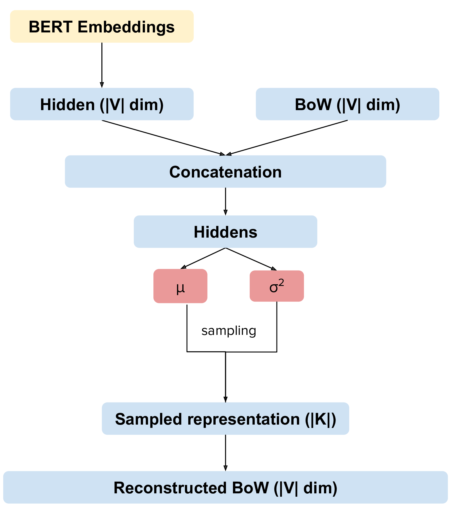
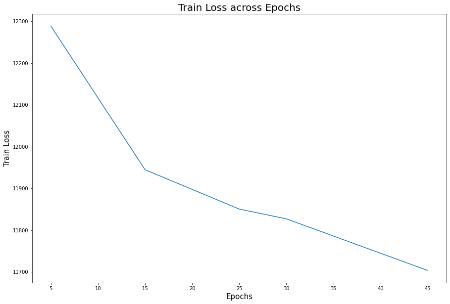
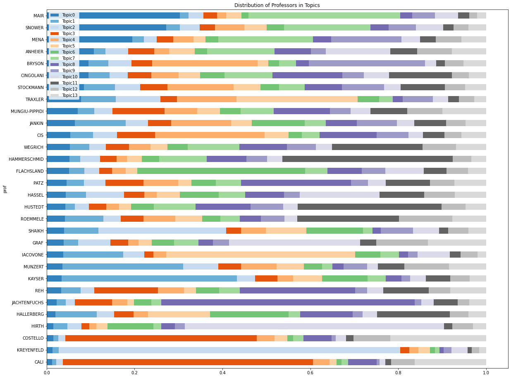

```{r setup, include=FALSE}
knitr::opts_chunk$set(echo = FALSE)

# Load dependencies 
library(reticulate) # For rendering Python code 
```

## Abstract 

To tackle the challenge of finding a suitable supervisor for second-year graduate students' master thesis research proposals at the Hertie School, we have built a tool that allows for a comprehensive, yet concise overview of the different areas of academic expertise covered by the school's faculty members. Currently, students preferences for thesis supervisors can be assumed to be mostly based on very limited and selective information about research areas and methodologies available at the school, such as through personal experience with some of the professors or fellow students' reports. However, the choice of the supervisor can impact both the progress and quality of a thesis as well as student’s work opportunities after graduation.
We determine areas of academic expertise by identifying underlying topics in each supervisor's body of academic publications, i.e. publicly available papers. Standard Latent Dirichlet Allocation (LDA) topic modelling often results in topics that do not achieve a high degree of coherence, especially when it comes to domain-specific vocabulary. Hence, we are proposing to leverage the power of Pre-trained Language Models (PLM) and neural topic models. Among the most promising state-of-the-art technologies do so is Contextual Topic Modeling (CTM) with pre-trained BERT sentence embedding (SBERT) to improve topic coherence and meaning across documents. While we find that embedded CTM is able to extract coherent topics from small data sets ($n < 900$) with longer text per document, it  achieves limited results for shorter texts per document. Therefore, we concluded that our original plan to match two sets of documents based on topic similarity is not feasible within our project, but still presents an interesting avenue for further research.
 

## Introduction / Background

Each fall semester, Hertie students and administrative staff alike are faced with the challenging task of finding a suitable and available supervisor for the students’ master theses. The process starts with students handing in research proposals, in which they have to indicate three ranked preferences for potential supervisors. It can be assumed that these preferences are mostly based on very limited information on and/or semi-random clues about professors’ research areas, methodologies and thematic focus.\n
While supervision plans issued by each of the 28 supervisors are available on Moodle, the process of manually downloading and exhaustively going through each of the document is likely to be both inefficient and tedious. It is therefore certainly a possibility that some students might not select a supervisor best-fitting to the topic, focus and research methodology of the their envisioned thesis. This is worrying because the choice of the supervisor is relevant to the progress and quality of a thesis, which in turn can determine a student’s work opportunities after graduation.\n
Against this background, our project's main goal is to increase the quality and efficiency of supervisor matching by developing a tool that provides a lucid and accessible overview over the wide range of fields of academic expertise in the school's faculty body. Thereby, we hope to alleviate frictions in the choice process due to asymmetric information and imbalanced demand for more popular and well-known professors, coincidentally also delivering a valuable contribution to our school community. Initially, a text matching system based on document-level topic similarity was envisioned. As a text classification task, the Toronto Paper Matching System constitutes a similar application case [@charlin2013toronto]. This approach has been proven to be unfeasible due to data quality constraints for our particular project setting. As a consequence, the project's focus remains on topic modeling.\n
To depict the areas of academic expertise that are covered by Hertie School's faculty members, we decided to employ topic modeling on their respective body of published academic work. However, such a retrospective approach has an important inherent limitation: it cannot show most recent advancements that deviate from a professor's past research. However, given that academic careers are usually constructed to deepen expertise in and expand knowledge about subject-specific areas that remain fairly stable across the years, this limitation can be neglected.\n
Topic modeling in general is a widely used tool and among the most useful ways to understand text on the document level. However, it has so far been missing out of the powerful benefits that pre-trained language models have to offer, even though using external knowledge on semantic relationships in text have been proven to increase topic coherence. Higher coherence is easier to interpret by humans and is considered more meaningful, hence more desirable in a setting where model outputs are meant to inform human users in their decision-making.\n
Contextualized Topic Models (CTM) addresses this gap by adding contextual information to neural topic models, thereby significantly improving coherence with competitive results in topic diversity [@bianchi2020pre]. We apply this innovative approach and achieve excellent results even with a very small sample ($n<900$), but unsatisfactory results for very short texts characterized by varying writing styles, quality and incomplete sentences, e.g. bullet points. Lastly, it should be noted that our projects expands the work done by last semester's students from the class "Python for Data Scientists", who built a simple LDA model and similarity index based on user input.^[Available under (https://github.com/cbsobral/python)]

## Related Work 

The challenge of topic modeling usually lies in the unsupervised detection of underlying topics in documents and the correct identification of patterns to match documents to topics. As a machine learning technique, Latent Dirichlet Allocation (LDA) is a popular probabilistic algorithm used for topic modeling. The Toronto Paper Matching System is also based on the LDA machine learning model. The Toronto Paper Matching System matches papers to initial expertise scores based on reviewers’ publications and cross-checks these matched with elicited scores based on reviewers’ self-assessed expertise.  Operating on a Bag-of-Words (BoW) representation, the Toronto Paper Matching System is able to do unsupervised classification of documents [@charlin2013toronto]. However, if each document is considered a collection of words, the goal is to identify discriminative words for the document. The structure of the document itself, i.e. the grammatical role and the order of words, is not relevant to this model. Because the goal is to identify words distinctive to the document, certain words that do not carry any meaning for that purpose are removed as "stop words" before running the model. Both of these functionalities constitute the main limitation of LDA: it is unable to comprehend the semantics and context of words.\n

The word2vec approach attempts to overcome that particular deficiency by the use of word embeddings. Word embeddings generally constitute learned representation for text with real-number vectors where words try to capture as much of the semantic, lexical and context information as possible. word2vec combines two different learning models, Continuous Bag of Words (CBoW), predicting a word given its context, and Skip-Gram, predicting the context given a word. Thus, using neural networks, the vectors are created by predicting for each word potential neighboring words. Words that have the similar meanings end up with similar representations.Though word2vec attempts to integrate the context, it only provides one vector numeric representation for each word. For example, the word "bank" would erroneously have the same numeric representation in the sentences *"We went to the river **bank**."*and *"I need to go to the **bank** to make a deposit."*. In combining different meanings and usages of the same word into a single vector, word2vec inadvertently ends up generating context-independent word embeddings.\n

In contrast to word2vec, the Pre-trained language model (PLM) Bidirectional Encoder Representations from Transformers (BERT) generates word embeddings that facilitate multiple vector numeric representations for the same word, depending on the context of the word in any given sentence. Thus, BERT word embeddings are context-dependent. Moreover, the PLM BERT exceeds the performance of uni- or single-direction language models by applying bidirectional training of the attention model Transformer to language modeling.\n 

Lastly, in previous stages of our work, we have also contemplated the employment of BERTopic , which leverages BERT embeddings and c-TF-IDF to create easily interpretable topics [@grootendorst2020bertopic]. TF-IDF combines two methods to generate features from textual documents: Term Frequency (FT) to get the raw count of words within a document and Inverse Document Frequency (IDF) to indicate the informative value of words by their frequency in a document compared to their frequency across all other documents. Thus, common words such as "and" would be punished by IDF for being of no value to the distinction of documents and the identification of topics. The transformation of TF-IDF to c-TF-IDF then involves the merging of all documents in one long document to concentrate on classes, i.e. topics. While promising at first, the performance of BERTopic was soon outrun by the other models, *ceteris paribus*.  


## Proposed Method 

CTM is based on the neural topic model Neural-ProdLDA and a contextualized document embedded representation created by Sentence-BERT (SBERT). Neural-ProdLDA trains a neural inference network to transform the Bag of Words (BoW) document representation of a given document into a continuous latent representation via the two parameters $\mu$ and $\sigma^2$ of a Gaussian distribution. Instead of using a multinomial distribution over individual words as is common in standard LDA, Neural-ProdLDA uses the weighted product of experts, leading to stark improvements in topic coherence. The continuous latent representation is then decoded and reconstructed in a BoW representation based on the Variational AutoEncoder. CTM combines Neural-ProdLDA by extending (concatenating) it with contextualized document embeddings from SBERT, which facilitates swift generation of sentence embeddings as opposed to word embeddings (see Fig. 1). On the whole, Bianchi et al. [-@bianchi2020pre] integrated contextualized document embeddings into a neural topic model to produce more coherent topics than previous neural topic models could achieve, while producing competitive results regarding topic diversity. Thus, the combination of a pre-trained document representations and  Bag-of-Words representation to increase the topic coherence appears to successfully overcome the limitation of sole Bag-of-Word (BoW) representations: the consideration of contextual information and word order.

```{r fig1, eval = TRUE, echo = FALSE, out.width = '50%', fig.cap = "High-level architectural schema of a CTM"}

```
## Experiments 

**Data**: The train data set consists of publicly available and raw academic papers written by supervisors. Due to the constraint Google Scholar imposes on web scraping, we were forced to manually download papers individually for each supervisor. The test data consists of students' individual thesis proposals, which aside from slight variation and - in contrast to the training data - follow a mostly coherent structure. Thesis proposals were donated by this year's student cohort. Supervision plans are currently used in the CTM as validation data.\n
The unprocessed data sets are made up of individual .pdf files, which were converted into raw text individually and then aggregated into a single .csv file, entailing two columns: the first column carries the file name, the second column holds the document content as a string. However, document contents are cut off after 32,767 characters, the upper limit per cell for .csv files, which we found useful to specify directly within our convertion function. The data sets then undergo preprocessing, i.e. the removal of common and custom-defined stopwords, punctuation, and rare words. 

```{python txt-csv, echo = TRUE, eval = FALSE}
def txt_to_csv(input_dir, output_dir, new_filename): 
  
  files = glob('/content/drive/MyDrive/ThesisAllocationSystem/' + input_dir + '/*.txt')
  data = [[i, open(i, 'rb').read()] for i in files]
  df = pd.DataFrame(data, columns = ['FileName', 'Content'])
  df['FileName'] = df['FileName'].str.replace('/content/drive/MyDrive/ThesisAllocationSystem/' + input_dir + '/', '')
  df['Content'] = df['Content'].str.slice(start = 0, stop = 32767) # Upper limit of strings per cell in csv
  df.to_csv(output_dir + '/' + new_filename + '.csv', index = False)
  if not df.empty: 
    print('Succesfully converted txt files in directory ' + os.path.basename('/content/drive/MyDrive/ThesisAllocationSystem/' + input_dir + ' to single csv file.'))
  else: 
    print('File empty.') 
  return None
```
 
**Software**: We used Google Colab notebooks for tasks that required high computational performance, i.e. GPU usage. The application prototype was developed on the Streamlit framework, using Visual Studio Code on a Windows local machine and PyCharm on a Linux Ubuntu local machine. For Windows, a virtual environment for python using conda from Anaconda was set up to facilitate running the Streamlit app on a local host. For version control, we relied on a shared GitHub repository.

**Evaluation method**: To evaluate model performance of our topic model, we looked at coherence and diversity of topics created. **Normalized Pointwise Mutual Information (NPMI)** is a suitable coherence metric. It uses empirical frequency of words in the original text corpus and measures degree of relatedness of top-10 words to the topic. However, NPMI is computed on the same data the model is trained on and is hence an inherently limited measure of coherence. Therefore, a second coherence measure was employed: external **word embeddings based topic coherence (WETC)**. It calculates average pairwise cosine similarity of the word embeddings of the top-10 words in a topic and computes an average across all topic. It relies on an external vocabulary for comparison, which allows for a more unbiased evaluation.\n
Additionally, the model's topic diversity was evaluated with the **Inverted Rank-Biased Overlap (IRBO)** metric. The method compares two ranked list of topics from the model, i.e. weights the list rank position of same words in a topic, penalizing same words that are higher in a topic list rank. It can take values between 0 and 1, where 0 indicates that all created topics are equal and 1 that they are completely different from one another. 

**Experimental details**: We experimented with setting different numbers of epochs in the hyper-parameter configurations of the CTM (`num_epochs` parameter to 5, 15, 25, 30, 45). As we train on a very small sample, training time was always just a few seconds. We experimented with number of topics to be created as well (`n_components` parameter to 28, 20 and 14 topics) It should be noted that there are currently little options available to further fine-tune and customize the model, as it has been published fairly recently and for research purposes only. 

```{python ctm params, echo = TRUE, eval = FALSE}
ctm = CombinedTM(input_size=len(qt.vocab), bert_input_size=768, num_epochs=25, n_components=14)

ctm.fit(training_dataset)
```

**Results**: We found that the model produces the best outputs with `num_epochs` set to 25 and `n_components` to 14.


**Comment on quantitative results**: Are they what you expected? Better than you expected? Worse than you expected? Why do you think that is? What does this tell you about what you should do next? Including training curves might be useful to discuss whether things are training effectively.

```{r fig1, eval = TRUE, echo = FALSE, out.width = '100%', fig.cap = "Train Loss"}

```

```{r fig1, eval = TRUE, echo = FALSE, out.width = '100%', fig.cap = Topic Distribution across Professors}

```

## Analysis 

Your report should include some qualitative evaluation. That is, try to understand your system (how it works, when it succeeds and when it fails) by measuring or inspecting key characteristics or outputs of your model.

- Types of qualitative evaluation include: commenting on selected examples, error analysis, measuring the performance metric for certain subsets of the data, ablation studies, comparing the behaviors of two systems beyond just the performance metric, and visualizing attention distributions or other activation heatmaps.

- The Practical Tips lecture notes has a detailed section on qualitative evaluation -- you may find it useful to reread it.

## Conclusion(s)

Summarize the main findings of your project, and what you learned. Highlight your achievements, and note the primary limitations of your work. If you like, you can describe avenues for future work.

## Acknowledgments 

List acknowledgments, if any. For example, if someone provided you a dataset, or you used someone else's resources, this is a good place to acknowledge the help or support you received.
